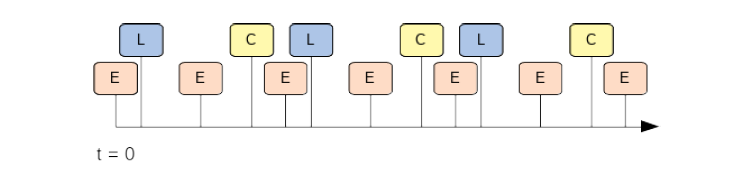
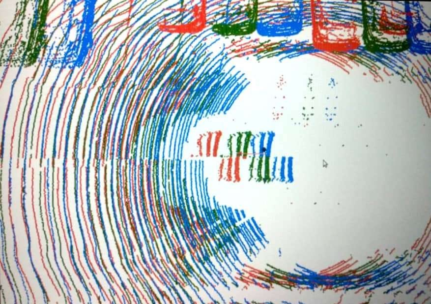

# 3d_sensor_fusion

## Overview 

This contains solution for course (RO47004) project of TU Delft masters robotics program. It relates to processing data 
coming from LIDAR and camera sensors placed on a moving vehicle and visualize them on a common reference frame. 

## Context

### Data provided
In the Practicum, we are provided with a (tiny) sample of this [dataset](https://eurocity-dataset.tudelft.nl/), consisting of:

* Ego-motion odometry measurements at different times t, namely the velocity vt and the
steering rate t. These measurements are recorded at a frequency of 50 Hz.

* Vision data from a stereo camera installed behind the windshield. This data has already
been processed so you can work with the left rectified RGB image and the corresponding
disparity image. Further, the camera parameters such as the baseline, the focal length
and the image center are given.

* 3D point cloud data from a LiDAR sensor that contain a 360-degree sweep of the environment
around the vehicle.

* The static transformations of the two sensors with respect to the vehicle coordinate system
are given as translation and rotation in 3D.

### Task
Below is a schematic of the incoming data over time. Since the vehicle has moved between measurements, the data
requires to compensate for this ego-motion to properly align the sensor data. In this assignment,
the data is processed and visualized in a common reference frame.

## Solution

### 1. Ego-motion from odometry measurements

* A non-linear motion model $x_t+\Delta_t = f(x_t,m_t,\Delta_t)$ of the vehicle is provided below. A function is written
to implement a single step from t to t + $\Delta_t$ of the motion model. 
* This function is used to compute the relative 2D pose between the ego-vehicle’s poses at two times t_{from} and $t_{to}$. 
This transforms 3D points measured in one frame of reference at time $t_{from}$ to a reference frame at time $t_{to}$.

  

### 2. 3D from LiDAR
* In below figure you see a point cloud from the LiDAR sensor of an ego-vehicle moving forward at about 10 m.
 The LiDAR scan starts in front of the ego-vehicle and from the bird-eye-view perspective rotates clockwise.

  

 
* Given the scan frequency f and the capture time t of the last point at end of the 360 degree scan, the time 
$t_x$ when the point $x = (x, y, z)$ was captured is derived using:

 

* The three subsequent point clouds after compensating the ego-motion in a single frame of reference looks like this

  

### 3. 3D from stereo vision

* Using the equations below, 3D positions (x, y, z) are computed per pixel from the disparity image with coordinates 
(u, v, d), given the camera information (focal length $f_x = f_y = f_{xy}$ with unit [pixels], image center 
$c_x, c_y$ ([pixels]) and the baseline b ([m]).

  

* Using above equation, given the camera parameters for the original image and the disparity image, the 3D position for all 
valid pixels are computed. Pixels that have an infeasible 3D position due to the disparity value are set to np:nan.

* A left rectified camera image is provided as input. Using this, every associated point in the point cloud obtained from the 
stereo camera, is assigned a pixel value. Once this is done, the stereo cloud looks like the image below in two different 
views(front, top). 
  
  

### 4. 3D point cloud sensor alignment
* Currently, the points of both sensors are given in different reference frames, i.e. each in their own in sensor 
coordinate frame. Given the sensor poses with respect to the vehicle frame of reference as translation and 
rotation, a function is implememted to transform to car frame which transforms the points from both sensor 
coordinates to a common coordinate frame— the coordinate frame of the vehicle. Additionally, the ego-motion is
compensated as the data of both sensors was captured at different times.

### 5. Occupancy grid

* Next,  a simple 2D occupancy grid map to accumulate the measurements over time is implemented. 
Consider a square 2D grid parallel to the x-y plane that discretizes  space into equally sized cells, like a checkerboard. 
The ego-vehicle is located in the center cell of the grid. Given a 3D point cloud of obstacle points measured by one of the
sensors, the grid denotes all cells that contain a 3D point as "occupied". All other cells remain "free" or "unobserved".

* The occupancy grid map should only include obstacles, thus the ground points need to be removed before incorporating 
the point cloud data into the grid map. For this purpose,a function is implemented that fits a 3D plane to the point cloud
data. It returns the fitted plane represented by three points which are on that plane. Then, all ground points are removed 
from the  point cloud while cinsidering up to 30 cm above the ground plane as ground, to account for noise and errors in the fit.

* Assuming coordinate frame of the grid and the coordinate frame of the vehicle are the same, a function is implement to that 
marks cells as "occupied".

* Below, a top-down view of a simple 2D occupancy grid. Black denotes that a cell is occupied. The blue point cloud is
the latest data input from the LiDAR. The thin green and blue arrows indicate the y and z axes, the x axes coincides 
with the first ego-pose and thus is hidden.

  

* The vehicle starts moving now and this movement needs to be accounted for when data is
accumulated over time. The cells of the occupancy grid however are associated to a certain
physical region! The current “view” of the occupancy grid only considers the cells within the
limits that were chosen due to memory limitations. The only movement that can be imposed
on the current “view” is by considering a different set of cells, i.e. moving in steps of cells.
For this reason, let’s distinguish the movement of the vehicle on two levels: firstly, the vehicle
can move such that its origin still remains within the same cell and secondly, it can move to a
different cell. The first kind of movement needs to compensated by transforming the incoming
point cloud from the vehicle frame of reference to the frame of the grid. The second kind of
movement is compensated by moving our current "view", meaning that we have to discard
some cells at one side of the grid and add some new cells. Below is a recording of the occupancy grid for a moving vehicle
after performing the above mentioned tasks.

## Acknowledgements
Course assignment of Machine Perception-RO47004 of Msc Robotics program @ TUDelft.
