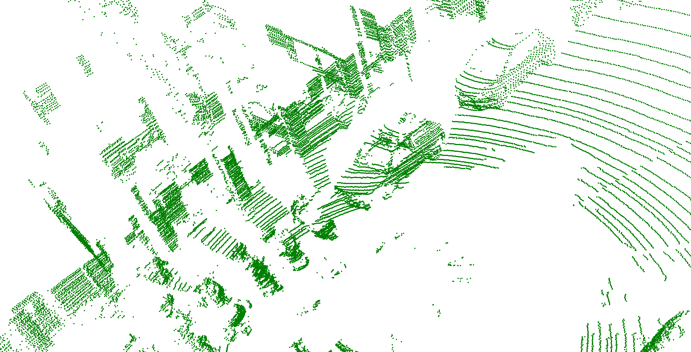
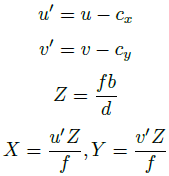

# 3d_sensor_fusion

## Overview 

This contains solution for course (RO47004) project of TU Delft masters robotics program. It relates to processing data 
coming from LIDAR and camera sensors placed on a moving vehicle and visualize them on a common reference frame. 

## Context

### Data provided
In the Practicum, we are provided with a (tiny) sample of this [dataset](https://eurocity-dataset.tudelft.nl/), consisting of:

* Ego-motion odometry measurements at different times t, namely the velocity vt and the
steering rate t. These measurements are recorded at a frequency of 50 Hz.

* Vision data from a stereo camera installed behind the windshield. This data has already
been processed so you can work with the left rectified RGB image and the corresponding
disparity image. Further, the camera parameters such as the baseline, the focal length
and the image center are given.

* 3D point cloud data from a LiDAR sensor that contain a 360-degree sweep of the environment
around the vehicle.

* The static transformations of the two sensors with respect to the vehicle coordinate system
are given as translation and rotation in 3D.

### Task
Below is a schematic of the incoming data over time. Since the vehicle has moved between measurements, the data
requires to compensate for this ego-motion to properly align the sensor data. In this assignment,
the data is processed and visualized in a common reference frame.

## Solution

### 1. Ego-motion from odometry measurements

* A non-linear motion model $x_t+\delta_t = f(x_t;m_t;\delta_t)$ of the vehicle is provided below. A function is written
to implement a single step from t to t + $\delta_t$ of the motion model. 
* This function is used to compute the relative 2D pose between the ego-vehicle’s poses at two times t_{from} and $t_{to}$. 
This transforms 3D points measured in one frame of reference at time $t_{from}$ to a reference frame at time $t_{to}$.

### 2. 3D from LiDAR

